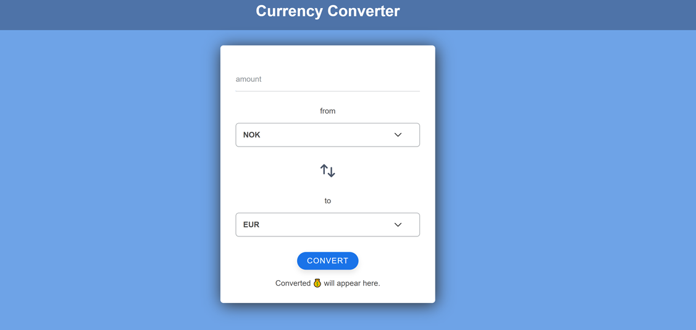
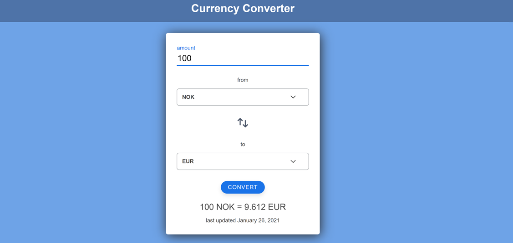

## Currency Converter

A web application used to convert currency according to the newest rates, built with React and CSS. Live exchange rates provided by <a href="https://exchangeratesapi.io" target="_blank">Exchange rates API</a>

## Project Screen Shot

### UI Before conversion

### After conversion

## Installation and Setup Instructions

Clone down this repository. You will need `node` and `npm` installed globally on your machine.

Installation:

`npm install`

To Start Server:

`npm start`

## Reflection

Project goals included using React technologies learned up until this point and familiarizing myself with documentation for new features.

Originally I wanted to build an application that allows users to pull data from the Exchange rates API and convert currency based on which one they selected. I chose to use the `create-react-app` boilerplate to minimize initial setup.
